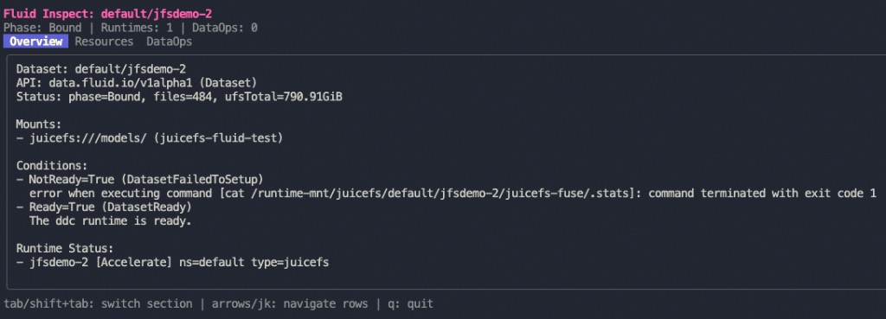
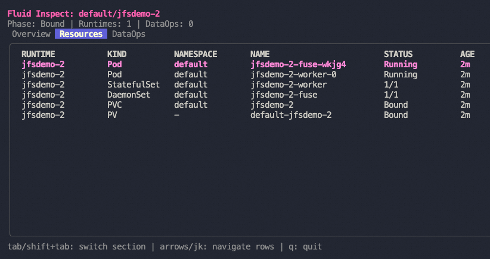
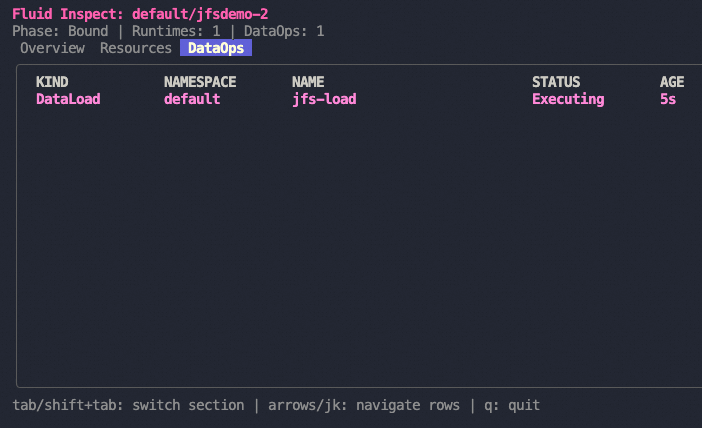
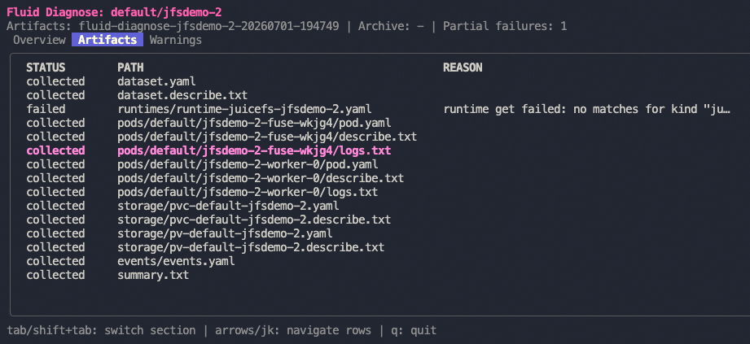

# Introducing Fluid CLI: Inspecting, Diagnosing, and AI-Assisted Troubleshooting for Fluid Datasets

## Table of Contents

- [Introduction](#introduction)
- [Why We Built Fluid CLI](#why-we-built-fluid-cli)
- [Building the TUI Experience](#building-the-tui-experience)
- [Installation](#installation)
- [Usage Guide](#usage-guide)
- [Key Features](#key-features)
- [Early Feedback: AI-Assisted Diagnosis in Practice](#early-feedback-ai-assisted-diagnosis-in-practice)
- [Future Improvements](#future-improvements)
- [Conclusion](#conclusion)

---

## Introduction

[Fluid](https://github.com/fluid-cloudnative/fluid) accelerates data access on Kubernetes by orchestrating distributed cache engines (Alluxio, JuiceFS, JindoFS, and others) behind a unified Dataset abstraction. Operating Fluid in production often means jumping between `kubectl` commands, controller logs, custom resources, and support threads to understand why a Dataset is stuck in `NotBound` or why a Runtime pod will not start.

We built **Fluid CLI** (`fluid`) to give operators and developers a focused, first-class command-line experience for Fluid workloads. Instead of assembling cluster state by hand, you can:

- **Inspect** a Dataset and its related Kubernetes resources in one place.
- **Diagnose** a Dataset by collecting a timestamped support bundle (YAML, events, logs, storage objects).
- Optionally run **AI-assisted analysis** that correlates symptoms with known Fluid failure patterns.

Fluid CLI is a standalone Go binary. It uses standard Kubernetes client configuration (`kubeconfig`, `--context`, `-n`) and does not require Fluid controllers to be modified.

---

## Why We Built Fluid CLI

Before Fluid CLI, troubleshooting a misbehaving Dataset typically involved several disconnected steps:

1. Fetch the Dataset and Runtime CRs with `kubectl get`.
2. Find pods by labels and inspect `describe` output.
3. Pull logs from FUSE or worker pods.
4. Scan namespace events for warnings.
5. Manually copy relevant YAML and logs into a GitHub issue or chat thread.

This workflow is slow, error-prone, and hard to repeat consistently across teams. We wanted a tool that:

- **Reduces toil** by automating resource discovery and artifact collection.
- **Works in both interactive and scripted environments** (terminal UI for humans, JSON/table/dir output for CI and support automation).
- **Encodes Fluid-specific knowledge** (Runtime types, label conventions, Dataset binding rules) so users do not have to memorize them.
- **Supports modern troubleshooting workflows**, including structured context export and optional LLM analysis for complex incidents.

Fluid CLI is intentionally scoped: it does not install Fluid, deploy applications, or manage cluster lifecycle. It complements `kubectl` and the Fluid documentation by answering one question well — *"What is going on with this Dataset right now?"*

---

## Building the TUI Experience

We built four Bubble Tea programs, each with a focused scope:

| Program | Package | Trigger |
|---------|---------|---------|
| Dataset picker | `pkg/tui/datasetselect` | `fluid inspect -n <ns>` (no dataset name) |
| Inspect viewer | `pkg/tui/inspect` | `fluid inspect <name>` (default `-o tui`) |
| Diagnose viewer | `pkg/tui/diagnose` | `fluid diagnose <name>` (default `-o tui`) |
| LLM config form | `pkg/tui/diagnoseconfig` | `fluid diagnose config` |

### Navigation model

Inspect and diagnose viewers share the same interaction pattern:

- **Three tabs** — switched with `Tab` / `Shift+Tab` (or `h`/`l`).
- **Scrollable tables** — arrow keys and `j`/`k` within table tabs.
- **Quit** — `q`, `Esc`, or `Ctrl+C`.

Inspect tabs: **Overview | Resources | DataOps**

Diagnose tabs: **Overview | Artifacts | Warnings**

The overview tab shows a text summary (Dataset phase, conditions, mount points, or diagnose `summary.txt`). Table tabs render collection status and warning events parsed from the manifest.

**Inspect — Overview** shows Dataset phase, mounts, conditions, and Runtime status in one screen:



**Inspect — Resources** lists related Pods, StatefulSets, DaemonSets, PVCs, and PVs:



**Inspect — DataOps** surfaces DataLoad and related operations for the Dataset:



**Diagnose — Artifacts** browses the collected support bundle, including per-file status and failure reasons:



### State management

Each TUI is a self-contained Bubble Tea model. State lives in the model struct (`activeTab`, table models, terminal dimensions). Window resize messages recalculate table heights so layouts adapt to the terminal size.

The diagnose command collects artifacts to disk **before** launching the TUI. The viewer reads `summary.txt` and `manifest.json` from the output directory — the TUI is a read-only browser over collected data, not a live cluster watch.

### Challenges

- **Terminal detection:** Scripts and CI pipelines must not hang waiting for keyboard input. We gate TUI entry with `EnsureInteractive()` and document non-TUI flags (`-o dir`, `-o table`, `-o json`).
- **Partial failures:** Real clusters produce incomplete bundles. The diagnose TUI surfaces partial failure counts and per-artifact status so operators know what is missing before sharing a bundle.
- **Consistent styling:** Shared helpers in `pkg/tui/common` (title, tabs, panel, table factory) keep inspect and diagnose visually aligned without a heavy design system.

---

## Installation

Fluid CLI is installed from source today. There is no Homebrew formula or `fluid install` subcommand in the repository at the time of writing.

### From source (recommended)

```bash
git clone https://github.com/fluid-cloudnative/fluid-cli.git
cd fluid-cli
make install-plugin
fluid --help
```

`make install-plugin` builds `bin/fluid` and copies it to a directory on your `PATH`.

### Manual install

```bash
make build
cp bin/fluid /usr/local/bin/fluid   # or any directory on your PATH
```

### Prerequisites

- A Kubernetes cluster with [Fluid installed](https://github.com/fluid-cloudnative/fluid/blob/master/docs/en/userguide/install.md) (CRDs and controllers running).
- A working kubeconfig (`kubectl` should succeed against the cluster).
- For TUI modes: a real terminal (not a pipe-only CI job).

### Verify

```bash
fluid version
fluid inspect --help
fluid diagnose --help
```

---

## Usage Guide

### `fluid inspect` — quick health check

Inspect discovers resources associated with a Fluid Dataset: Runtimes, Pods, StatefulSets, DaemonSets, PVCs, PVs, Services, and DataOps.

```bash
# Interactive TUI (default)
fluid inspect my-dataset -n default

# Pick a dataset interactively
fluid inspect -n default

# Script-friendly output
fluid inspect my-dataset -n default -o table
fluid inspect my-dataset -n default -o json
fluid inspect my-dataset -n default -o yaml --wide
```

| `-o` value | Description |
|------------|-------------|
| `tui` (default) | Full-screen terminal UI with Overview, Resources, and DataOps tabs |
| `table` | Columnar text output |
| `json` / `yaml` | Structured documents for automation |

Use inspect when you want a fast snapshot without collecting pod logs. Use diagnose when you need a support bundle.

### `fluid diagnose` — support bundle collection

Diagnose collects a timestamped directory of artifacts and optionally packages it as `tar.gz`.

```bash
# Collect and browse results in the TUI (default)
fluid diagnose my-dataset -n default

# Write artifacts only (no TUI) — suitable for scripts and CI
fluid diagnose my-dataset -n default -o dir

# Create an archive for attaching to a support ticket
fluid diagnose my-dataset -n default -o dir --archive

# Skip pod logs in large clusters
fluid diagnose my-dataset -n default -o dir --no-logs

# Limit log and event collection to the last hour
fluid diagnose my-dataset -n default -o dir --since 1h

# Include Fluid controller logs from fluid-system
fluid diagnose my-dataset -n default -o dir --include-controller-logs
```

#### Output layout

```
fluid-diagnose-my-dataset-20260314120000/
├── dataset.yaml
├── dataset.describe.txt
├── runtime/
├── pods/
├── events/
├── storage/
├── controllers/          # if --include-controller-logs
├── summary.txt
├── manifest.json
├── context.json          # structured diagnostic context
├── prompt.txt            # LLM-ready prompt text
└── llm-analysis.txt      # when --llm is used
```

After collection, the CLI prints paths to the artifact directory, context files, archive, and any partial failure count.

### `fluid diagnose config` — LLM settings

Configure an OpenAI-compatible endpoint interactively or via subcommands:

```bash
# Interactive form (Bubble Tea)
fluid diagnose config

# Non-interactive
fluid diagnose config set llm-endpoint https://api.openai.com/v1
fluid diagnose config set llm-model gpt-4o-mini
export FLUID_LLM_API_KEY=sk-...

fluid diagnose config view
```

### AI-assisted diagnosis

By default, diagnose writes `context.json` and `prompt.txt` without calling an external API. Pass **`--llm`** to opt in to automated analysis when an endpoint and API key are configured:

```bash
fluid diagnose my-dataset -n default -o dir --llm
```

The pipeline:

1. Build a trimmed **DiagnosticContext** (Dataset, Runtimes, pods, warning events, summary).
2. Run **FAQ matching** against built-in rules and optional `--faq-file` catalog.
3. Format a structured **prompt** with matched FAQs and reference material.
4. Call the configured LLM and write **`llm-analysis.txt`**.

FAQ flags:

```bash
# Disable FAQ matching
fluid diagnose my-dataset -o dir --faq-skip

# Merge custom rules from the Fluid repo or your own catalog
fluid diagnose my-dataset -o dir \
  --faq-file /path/to/fluid/docs/diagnose-faq.yaml
```

### `fluid version`

```bash
fluid version
```

Prints version, git commit, and build date embedded at compile time via Makefile `LDFLAGS`.

---

## Key Features

### Interactive terminal workflows

Default output modes open full-screen TUIs for inspect and diagnose. Operators can explore Dataset state and diagnose results without leaving the terminal.

### Fluid-aware resource discovery

The inspect package maps Fluid Runtime types to Kubernetes label conventions (`JuiceFSRuntime` → `app=juicefs`, etc.) and walks the ownership graph from Dataset to pods, storage, and DataOps.

### Timestamped support bundles

Diagnose produces reproducible artifact directories with a machine-readable `manifest.json`. Partial failures are recorded per file, not silently dropped.

### Structured AI context

Rather than sending raw YAML dumps to an LLM, we build a trimmed JSON context and a diagnosis-focused prompt. Built-in FAQ rules (`faq-dataset-not-bound`, `faq-no-runtime-reported`, and others) fire deterministically before the model runs, grounding analysis in known Fluid failure modes.

### Opt-in LLM analysis

LLM calls are explicit (`--llm`). Collecting cluster context and prompts does not require network access or API credentials — important for air-gapped clusters and privacy-sensitive environments.

### Kubernetes-native authentication

Fluid CLI reuses your existing kubeconfig. No separate login flow or Fluid-specific credentials are required beyond LLM settings for AI analysis.

---

## Early Feedback: AI-Assisted Diagnosis in Practice

### Scenario

In a real misconfigured cluster, a Dataset (`jfsdemo-2`) was stuck in **`NotBound`**. The underlying issue involved a Runtime pod that could not start (image not found), but the collected context also exposed a **naming mismatch**: the Dataset was named `jfsdemo-2` while events referenced a `JuiceFSRuntime` named `jfsdemo`. In Fluid, a Dataset and its Runtime must share the same name within a namespace to bind.

### What the analysis surfaced

The LLM report aligned closely with what an experienced Fluid operator would investigate, organized into clear sections:

**Unhealthy signals**

- Dataset stuck in `NotBound`.
- Zero associated runtimes discovered in the diagnostic context.
- Warning events referencing JuiceFS DDC engine setup failure (`.stats` file read from FUSE mount path failed).

**Evidence correlation and matched FAQs**

- **`faq-dataset-not-bound`** — applied; consistent with a missing or incorrect Runtime reference.
- **`faq-no-runtime-reported`** — applied; zero runtimes reported, matching the discovery gap from the naming mismatch.

**Ranked hypotheses**

1. **Dataset / Runtime name mismatch (high confidence)** — `jfsdemo-2` vs `jfsdemo` prevents binding.
2. **JuiceFS FUSE mount / engine initialization failure (high confidence)** — independent mount or credentials issue that would block readiness even after renaming.

**Uncertainties and follow-ups**

- Confirm whether a `JuiceFSRuntime/jfsdemo-2` exists or only `jfsdemo` is present.
- Inspect FUSE pod and controller logs for authentication or backend connectivity errors.
- Review `JuiceFSRuntime/jfsdemo` status conditions for the exact failing setup stage.

This exercise validated several design choices:

- **FAQ matching before the LLM** gives the model structured anchors instead of free-form guessing.
- **OpenAI-compatible endpoints** let teams use their preferred provider without vendor-specific client code in the CLI.
- **The support bundle + context pipeline** produces enough signal for useful analysis even when multiple root causes overlap (naming mismatch *and* image pull failure).

---

## Future Improvements

These are directions we are considering; they are not committed roadmap items:

- **Packaged releases** — pre-built binaries and optionally a Homebrew formula to remove the `make install-plugin` requirement.
- **Expanded FAQ catalog** — ship and version FAQ rules alongside Fluid releases; improve Markdown FAQ ingestion from the main Fluid documentation.
- **Richer inspect output** — deeper Runtime condition details and pod log snippets in the inspect TUI without full diagnose collection.
- **CI-friendly diagnose profiles** — preset flag combinations (`--no-logs`, `--since`, `--archive`) for support bots and GitHub Actions workflows.
- **Additional output formats** — e.g. SARIF or structured issue templates generated from `context.json`.

---

## Conclusion

Fluid CLI is our answer to a practical problem: **Fluid Dataset troubleshooting is multi-resource, log-heavy, and domain-specific**, and generic Kubernetes tools alone do not capture the full picture.

We built it with:

- **Cobra** for a familiar, grouped command structure aligned with the Kubernetes ecosystem.
- **Bubble Tea, Bubbles, and Lip Gloss** for interactive inspect and diagnose experiences in the terminal.
- **controller-runtime and client-go** for typed Fluid CRD access and core API operations.
- A **diagnose pipeline** that produces reproducible support bundles, structured context, FAQ-grounded prompts, and optional LLM analysis.

For operators, that means faster incident response and cleaner support handoffs. For developers contributing to Fluid, it means encoding operational knowledge into a tool that gets better as the FAQ catalog and inspect logic grow.

If you run Fluid on Kubernetes, try:

```bash
fluid inspect <your-dataset> -n <namespace>
fluid diagnose <your-dataset> -n <namespace> -o dir --archive
```

We welcome issues and contributions in the [fluid-cli repository](https://github.com/fluid-cloudnative/fluid-cli).

---

*License: Apache 2.0. Fluid CLI is part of the Fluid Cloud Native project.*
