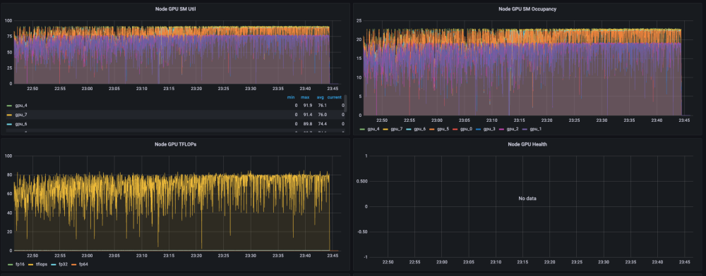

# Alibaba's Case Study
> This article discusses the significant role of Fluid with JindoCache in the large-scale model training within Alibaba Group.

*By Wang Tao (Yangli), Chen Qiukai (Qiusuo) and Xu Zhihao (Dongyun)*
## 1. Background Information
In 2024, new technology trends, such as the large model, artificial intelligence generated content (AIGC), and multi-modal technologies, begin to be integrated with actual business and put into production. These new technology trends not only increase the requirement for computing power, but also bring greater challenges to the underlying infrastructure.

In the computing field, heterogeneous hardware, such as graphics processing units (GPUs) and field programmable gate arrays (FPGAs), adapts to changing needs through short-cycle iterations and evolution. Alibaba Group adopts a variety of scheduling methods, such as centralized scheduling, unified resource pool, and comprehensive elasticity, to meet complex computing needs.

In the storage field, classic microservices applications achieve a balance between performance and efficiency based on the cloud-native architecture. However, for computing-intensive applications with the largest increase in the computing capacity, such as distributed AI training and big data, data locality directly affects the operation efficiency and throughput of computing jobs. The consumption of network I/O operations also indirectly increases the bandwidth costs. In addition, in predictable scenarios, the size of datasets will continue to grow rapidly. Accelerating data access with appropriate data cache affinity technologies will be the key to improving the efficiency of computing jobs while reducing costs.

Datasets in large model training and multimedia scenarios mainly consist of pictures and audio files. [Object Storage Service](https://www.alibabacloud.com/en/product/object-storage-service) (OSS) is naturally suitable for managing the data. It is also a storage service for most online computing jobs. For example, data read operations in training scenarios have the following characteristics:

1. Sequential randomization of datasets causes failures of conventional standalone cache policies.

2. Datasets are read for multiple times during multiple epochs.

3. A dataset may be reused in different jobs.

To sum up, distributed caches and file systems are naturally suitable for accelerating I/O operations in multiple AI platform business domains of Alibaba Group.

## 2. Chanllenges
1. The compute-storage separation architecture improves the flexibility of data access and horizontal scaling of computing resources, but leads to a high latency in data access. This is unfriendly to training scenarios with a high requirement for data cache affinity. Machine learning tasks for business teams must frequently access sample datasets and checkpoints in OSS in real time during training. When OSS has limited bandwidth or high load, data access to OSS is one to two orders of magnitude slower than that to local files, and causes high bandwidth costs.

2. The Kubernetes scheduler is unaware of data caches, and access to a data source remains slow after multiple times of access. In practice, the same data is repeatedly accessed by deep learning tasks, including tasks with the same model but different hyperparameters, tasks with fine-tuned models but the same input, and AutoML tasks. Repeated data access by the deep learning tasks results in reusable data caches. However, because the native Kubernetes scheduler is unaware of caches, the result of application scheduling is poor, caches cannot be reused, and performance cannot be improved.

3. OSS has become the bottleneck of concurrent data access, and stability is faced with great challenges. A large number of machine learning tasks concurrently access OSS during simultaneous training. Such concurrent machine learning training causes high I/O load, and OSS is prone to single points of failure (SPOFs). When bandwidth of OSS is limited, all machine learning tasks are affected.

4. Training files are scattered, and metadata access is under high pressure. Training data files of machine learning tasks are usually scattered in different paths, and list operations for reading the files take an extended period of time. The performance of list operations in OSS is suboptimal. When performed at a large scale, these operations are prone to timeouts or failures due to the heavy load on metadata access.

5. I/O stability directly affects business operation. Poor I/O stability leads to unstable business performance or even causes task failures. FUSE-based storage clients are more prone to such problems. If these problems cannot be automatically solved, cluster training tasks may be interrupted. Maintaining I/O stability is one of the keys to ensuring smooth business operation.

Based on analysis of the preceding typical data access patterns, it is found in practice that expensive computing resources such as GPUs cannot be fully utilized due to I/O performance issues. The nature of machine learning training results in scattered data file access and high metadata access load. If metadata and file data can be cached in a fine-grained manner, cache efficiency and disk utilization can be improved, and metadata loss caused by file lookup operations can also be mitigated.

## 3. Efficient Cache Scheduling Acceleration System for Deep Learning Tasks
To improve efficiency of large-scale machine learning model training for Alibaba Group, better data localization must be achieved for data access during model training. Therefore, the following objectives are established:

1. ully utilize local data access in computing: Repeated read operations through the network are prevented, and the time taken by I/O operations in the computing pipeline is minimized, thus accelerating training for machine learning models and improving GPU utilization of clusters.

2. Reduce the load on OSS: Applications read some data from local storage, thus reducing the latency in data access and the load on the bandwidth of OSS.

3. Leverage the cache nodes for hot datasets: Tasks are intelligently scheduled onto data cache nodes without user awareness, thus accelerating the operation of common model training programs.

4. Separate metadata caches from data caches: You can separately cache metadata of files and customize cache policies.

5. Read data through POSIX-based APIs: You do not need to use different data access APIs during model development and training, thus reducing the costs of developing machine learning model programs.

### 3.1 Components of the Project Architecture
#### Fluid
[Fluid](https://github.com/fluid-cloudnative/fluid) is an open source scalable distributed data orchestration and acceleration system. It enables data access for data-intensive applications such as AI and big data based on the Kubernetes standard without user awareness. It is intended to build an efficient support platform for data-intensive applications in cloud-native environments. Based on data layer abstraction provided by Kubernetes services, Fluid can flexibly and efficiently move, replicate, evict, transform, and manage data between storage sources such as HDFS, OSS, and Ceph and upper-layer cloud-native computing applications of Kubernetes. Specific data operations are performed without user awareness. You do not need to worry about the efficiency of accessing remote data, the convenience of managing data sources, or how to help Kubernetes make O&M and scheduling decisions. You can directly access abstracted data from Kubernetes-native persistent volumes (PVs) and persistent volume claims (PVCs). Remaining tasks and underlying details are all handled by Fluid.

Fluid supports multiple runtimes, including JindoRuntime, AlluxioRuntime, JuiceFSRuntime, and GooseFSRuntime. JindoRuntime has outstanding capabilities, performance, and stability, and is applied in many scenarios. [JindoRuntime](https://github.com/aliyun/alibabacloud-jindodata/blob/master/docs/user/6.x/6.2.0/jindo_fluid/jindo_fluid_overview.md) is a distributed cache runtime of Fluid. It is built on JindoCache, a distributed cache acceleration engine.

#### JindoCache
JindoCache, formerly known as JindoFSx, is a cloud-native data lake acceleration service provided by the data lake management team of Alibaba Cloud. JindoCache supports acceleration features such as data caching and metadata caching. JindoCache can use different CacheSets for different file paths to provide different read/write policies to meet the requirements for access acceleration in different scenarios of data lakes.

JindoCache is applicable to the following scenarios:

- Online analytical processing (OLAP) (Presto queries), to improve query performance and reduce query time.

- DataServing (HBase), to significantly reduce the P99 latency and request costs.

- Big data analysis (Hive/Spark reports), to reduce report output time and costs of computing clusters.

- Data lakehouse, to reduce request costs and the catalog latency.

- AI and training acceleration, to reduce the costs of using AI clusters and provide more comprehensive capability support.

#### KubeDL
KubeDL is a Kubernetes (ASI)-based AI workload orchestration system for managing the lifecycle of distributed AI workloads, interaction with layer-1 scheduling, failure tolerance and recovery, as well as dataset and runtime acceleration. It supports the stable operation of more than 10,000 AI training tasks on different platforms in the unified resource pool of Alibaba Group every day, including but not limited to tasks related to Taobao, Alimama, and DAMO Academy business domains. You can download the [open source edition of KubeDL](https://github.com/kubedl-io/kubedl) from GitHub.

#### Overall Project Architecture

### 3.2 Benefits of JindoCache-based Fluid
1. Fluid can orchestrate datasets in Kubernetes clusters to co-deploy data and computing, and provide PVC-based APIs for seamlessly integrating Kubernetes applications. JindoRuntime can accelerate data access and caching in OSS. POSIX-based APIs of FUSE allow you to easily access large numbers of files in OSS the way you access local disks. Deep learning training tools such as PyTorch can read training data through POSIX-based APIs.

2. Fluid provides distributed metadata and data caches.

3. Fluid supports metadata preloading to prevent a large number of metadata operations on training files in OSS, and supports data preloading to prevent contention for data access due to data pulling during training.

4. Data affinity scheduling of Fluid is called by using KubeDL. You do not need to know the locations of nodes where caches are stored or nodes that may be migrated at any time in scaling scenarios. Fluid schedules tasks with data dependencies in combination with cache nodes to short-circuit read operations and maximize performance.

5. JindoCache provides a variety of distributed caches. You can select appropriate cache policies based on your business requirements. For example, the cache-aside (lazy loading) policy is selected for cache read operations: When an application needs to read data, it first checks the cache to determine whether the data is available. If the data is available (the cache is hit), the cached data is returned. If the data is unavailable (the cache is missed), the data is queried from the underlying storage, added to the cache, and then returned to the caller. In addition, the write-through policy is selected for cache write operations. Files written by an application to the underlying file system are also written to the cache system. This way, this part of data can be directly read from the cache system next time, thus greatly improving read efficiency.

6. Fluid supports self-healing of FUSE mount targets. It can automatically check and recover disconnection of FUSE mount targets caused by out-of-memory (OOM) and other exceptions. This prevents data access exceptions and ensures the stable operation of online business on AI platforms.

### 3.3 Practice
In practice within Alibaba Group, end-to-end data I/O acceleration is provided for AI platforms based on job orchestration capabilities of KubeDL and caching capabilities of JindoRuntime-based Fluid in combination with idle local resources such as memory and high-performance disks in the huge heterogeneous computing resource pool of Alibaba Group.

1. The huge unified heterogeneous resource pool of Alibaba Group provides resource sales levels with differentiated service level objectives (SLOs) and contains a variety of resources at different levels, including highly guaranteed resources, spot instance resources, periodically offline resources, and normal offline resources. Models, SSDs, and high-performance network interface cards (NICs) of different generations are used with multi-level cache media of JindoCache to make full use of idle resources in the unified resource pool.
2. Based on the composition of JindoCache clusters, highly guaranteed computing resources are used to run metadata services, and elastic offline resources are used to run I/O bound cache node services. This fully incorporates the scheduling characteristics of the resource pool of Alibaba Group and minimizes user costs.
3. KubeDL provides distributed training task management, and Fluid provides dataset management. They support automatic reuse of the same data sources of different users across jobs and even automatic reuse of the same data sources of different platforms in the unified resource pool. Based on the reference count of jobs, KubeDL can automatically recycle idle datasets to reduce user costs.

### 3.4 Experience
#### Experience is summarized from the practice in the following five aspects:
1. Select appropriate cache nodes: JindoRuntime can achieve higher local data access performance. In production, nodes with poor disk and network I/O performance are not suitable for caching data. Therefore, select nodes with large disk sizes and high network I/O performance. Fluid supports scheduling of datasets, in other words, scheduling of cache nodes. It schedules cache nodes based on the node affinity of datasets so that the cache nodes can provide efficient cache services.

2. Configure the cache capacity and path: You can specify the `mounts` field of datasets and tieredstore of JindoRuntime to set the mount directory of data. To prevent excessive data from being cached, you can specify tieredstore of JindoRuntime to limit the maximum cache capacity and watermark. Data that exceeds the watermark is automatically discarded. You can also specify tieredstore to set the cache path and storage media, such as SSD, memory, or HDD, to meet the needs of various scenarios. In multi-node scenarios, the replacement feature of datasets allow you to deploy multiple datasets in one cluster.

3. Set cache security policies: When you create a dataset in Fluid, you may need to configure sensitive information in `mounts`, such as the AccessKey ID and AccessKey secret of your OSS account. To ensure security, Fluid allows you to use secrets to configure the sensitive information. You can create a secret and specify the name of the secret in the `EncryptOptions` field of the dataset to bind the sensitive information.

4. Data preloading: After you create a dataset and JindoRuntime, all files in the data directory are downloaded when you access the mounted data for the first time. This causes a waste of space and network resources if the data directory contains data that is not needed. To prevent this problem, Fluid supports data preloading and metadata caching. You can create a dataload to read the path of data to be preloaded. This way, data can be dynamically injected. Dataloads can cache metadata and block access to non-preloaded data, thus greatly improving the efficiency of data access.

5. Enable self-healing of FUSE mount targets in Fluid: During the operation of online business, FUSE processes may crash and restart due to insufficient memory resources. Consequently, FUSE mount targets in the business container are disconnected, and data access exceptions occur, affecting the availability of online business. You can enable self-healing of FUSE mount targets in Fluid. This way, Fluid automatically detects and fixes disconnected mount targets to continuously ensure the stable operation of online business.

### 3.5 Results
#### Read Sample Acceleration
The effect of Fluid is verified in an end-to-end manner based on real user jobs in the production environment.

**Task**: LLaMA 13B pre-training task

**Test environment:**

Cluster and model: high-performance A800 server cluster equipped with remote direct memory access (RDMA) NICs and NVMe disks

**Default specifications of Fluid :** 24 × 32Gi cache workers and NVMe disks, which are more cost-effective than memory

**Conclusion:**

**LLaMA 13B Pre-trained Model**
| I/O access mode        | GPU Util             | SM Util                       | TFLOPs (log)               | TFLOPs (amperf)                |
|------------------------|----------------------|-------------------------------|----------------------------|--------------------------------|
| Direct connection      | 100%                 | ~60%                          | ~135                       | Up to 60 (avg: 10m)            |
| Fluid with JindoRuntime| 100%                 | Up to 80% (increased by 33%)  | Up to 160 (increased by 18%)| Up to 72 (avg: 10m) (increased by 20%)|

**Monitoring Data: Direct Connection without Caching**

**Monitoring Data: Caching Enabled**

The overall average GPU utilization is also close to 100%, and the loads of GPUs are uniform and are all close to 100%.

#### Checkpoint Acceleration
**Training and Offline Inference Scenarios**
A distributed training task loads a checkpoint model file to continue training each time it is restarted. The model size ranges from tens of GB to hundreds of MB. In addition, a large number of offline inference tasks occupy many spot instance resources in the unified resource pool. Resources of an inference task can be preempted at any time, and the task will reload the model for offline inference after a failover. Therefore, a large number of jobs load the same checkpoint file after restart.

Distributed cache acceleration of Fluid converts multiple remote read operations into a single local read operation. This greatly accelerates job failovers and prevents bandwidth costs caused by multiple repeated read operations. In a typical large model scenario, the size of the model file is approximately 20 GB based on the 7B parameter size with FP16 precision. Fluid reduces the model loading time from 10 minutes to approximately 30 seconds.

**Spot Scenarios of Training (write-through)**
In spot scenarios of distributed training, if resources of a synchronous training task are preempted, it is usually restarted globally through a failover to continue training. KubeDL cooperates with layer-1 scheduling to instruct, through interactive preemption, the rank 0 node of the training task to record an on-demand checkpoint to save the latest training progress. After the restart, the task can reload the latest checkpoint to continue training as soon as possible. This leverages low costs of spot instance resources and minimizes the costs of training interruption.

The write-through feature in the latest version of JindoRuntime of Fluid allows a restarted task to immediately load the latest model file from the local cache cluster, instead of passively loading the latest model file from the remote storage. The end-to-end failover time is reduced from 10 minutes to 2 minutes on average. This reduces the loss of idle computing power by 80%.

## 5. Summary and Outlook
JindoRuntime-based Fluid plays an important role in large-scale machine learning model training for Alibaba Group. In read sample acceleration, it greatly increases the system throughput and achieves more balanced load utilization between GPUs. In addition, the abstraction layer of JindoRuntime shields the differences between JindoCache versions, thus supporting seamless upgrades. In checkpoint acceleration, end-to-end model loading is significantly accelerated, thus significantly improving performance at low costs.

In the future, Fluid is to be applied in more scenarios and provide extended features based on existing ones:

1. Automatically recycles idle datasets based on reference counts, to automatically manage idle datasets.

2. Intelligently preloads data: automatically preloads data based on the data access mode of tasks, preloads or evicts data by directory priority, and supports splitting of a preload task by directory for parallel preloading.

3. Adopts the RDMA technology to increase the throughput of workers in clusters, to fully utilize high-performance network infrastructure of clusters.
   
Based on cache acceleration capabilities and multi-JindoCache orchestration capabilities of Fluid, the operation mode and integration of upper-layer systems are to be optimized, to improve hardware and software collaboration and further enhance performance and support new hardware.

## Reference
[1] Fluid: https://github.com/fluid-cloudnative/fluid

[2] JindoCache: https://github.com/aliyun/alibabacloud-jindodata/blob/master/docs/user/6.x/6.2.0/jindo_fluid/jindo_fluid_overview.md