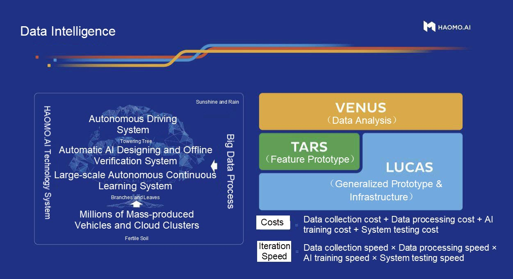

# HAOMO's Case Study

> This article mainly discusses the application of HAOMO.AI's machine learning platform in autonomous driving scenarios.

*By Li Fan, Server-end Development Engineer of HAOMO.AI, responsible for the development of the AI automatic training platform and algorithm optimization and Chen Tiewen, Server-End Development Engineer of HAOMO.AI, responsible for the upper layer development of the AI automatic training platform*

[Fluid](https://www.alibabacloud.com/help/doc-detail/208335.htm) is an open-source cloud-native data orchestration and acceleration project of CNCF, initiated jointly by Nanjing University, Alibaba Cloud, and the Alluxio community. This article mainly discusses the application of HAOMO.AI's [machine learning platform](https://www.alibabacloud.com/product/machine-learning) in autonomous driving scenarios and how to break the performance bottleneck of the existing architecture that separates storage and computing based on Fluid + JindoFS. The utilization of production resources can be improved with [Fluid](https://www.alibabacloud.com/help/doc-detail/208335.htm) + [JindoFS](https://www.alibabacloud.com/help/doc-detail/199488.htm), and the pressure on [OSS](https://www.alibabacloud.com/product/object-storage-service) bandwidth can be alleviated, thus improving the training efficiency in production practice significantly.

## 1. Autonomous Driving Is Moving into the Fast Lane of Commercial Application

HAOMO.AI is an AI technology company dedicated to autonomous driving and provides intelligent logistics solutions. We aim at zero accidents, zero congestion, free traveling, and efficient logistics. We help clients reshape and comprehensively upgrade the traveling and logistics modes of the whole society.

Data intelligence is the core capability of our company. We provide three vertical products for data intelligence: autonomous driving systems and solutions for passenger vehicles, ecosystem and solutions for low-speed driverless cars, and development and customized services for autonomous driving-related products.

Data intelligence can also help these vertical products and consolidate their leading positions in their respective markets in return. After nearly ten years of accumulation, full-stack exclusive development, and abundant R&D investment, we have accumulated relevant data in the aspects of passenger cars, low-speed driverless cars, and intelligent hardware. Currently, we have incubated more than ten mature products, such as Xiaomohe, Xiaomotuo, and Xiaomopan.

The rapid development of HAOMO.AI also reflects that higher-level intelligent driving will play a role in a wider range of scenarios, and autonomous driving is moving into the fast lane of commercial application.

## 2. Training Effectiveness of Traditional Machine Learning Encounters a Bottleneck

The machine learning platform has played a very central role in the widespread application of machine learning in autonomous driving scenarios. The platform adopts the architecture with separation of storage and computing, which decouples computing resources from storage resources. As such, it provides flexible resource allocation, realizes convenient storage expansion, and reduces storage and O&M costs.

However, this architecture also brings some challenges, among which the most critical ones lie in data access performance and stability:

**1) The separation of computing and storage leads to high latency in data access and slows down the training.**

Our business teams need to frequently access the data on OSS in real-time during the training process of machine learning tasks. When OSS bandwidth is limited or the pressure is high, accessing data on OSS is much slower than accessing local files.

**2) The Kubernetes scheduler cannot perceive the data cache, and the access to the same data source is still slow after running it multiple times.**

In real-world applications, deep learning tasks access the same data repeatedly, including tasks with the same model but different hyperparameters, tasks with the fine-tuning model and the same input, and AutoML tasks. Repeated data access of this deep learning task results in a reusable data cache. However, the native Kubernetes scheduler cannot perceive the cache. So, the result of application scheduling is not good, and the cache cannot be reused, which cannot improve the performance.

**3) OSS becomes a bottleneck of concurrent data access, bringing challenges to stability.**

A large number of machine learning tasks on the HAOMO.AI machine learning platform concurrently access the backend OSS storage during simultaneous training. The I/O pressure caused by this concurrent machine learning training is relatively high, and OSS service becomes a single point of performance. Once OSS bandwidth has a bottleneck, all machine learning tasks will be affected.

**4) Training files are scattered, and metadata pressure is high.**

The training data files of machine learning tasks are usually scattered in different paths. The list operation in reading these files takes a lot of time and has poor performance on OSS. Therefore, there is a lot of pressure on OSS metadata when performing large-scale list operations. Timeouts or list failures often occur.

In real-world applications, through monitoring and analysis on the HAOMO.AI machine learning platform, we found that the I/O performance problem will make expensive computing resources, such as GPU, not fully utilized. The characteristics of machine learning training lead to scattered access to data files and high metadata pressure. If metadata and file data can be cached carefully, cache efficiency and disk utilization can be improved, and the metadata loss issue caused by file lookups can be solved.

## 3. Production Practice of Accelerating Model Inference and Training Based on Fluid + JindoRuntime

It is necessary to improve the data localization on data access during model training to meet the requirements of high efficiency in large-scale machine learning model training. We hope to achieve the following goals:

- Computing can make full use of localization to access data, so data does not need to be read repeatedly through networks. This will accelerate the training of the machine learning model and improve the GPU usage of clusters.
- The load pressure on OSS can be reduced. The latency in data access and the bandwidth pressure on OSS can be reduced by applying local reading of some data.
- The advantages of cache nodes for hot data sets can be maximized. So, they can intelligently schedule tasks to data cache nodes without the perception of users. Thus, common model training programs can be faster.
- Specified files are cached in a custom file list. Only the files that require training are cached, which improves the cache usage and disk utilization.
- Metadata cache and data cache are separated. We can independently cache the metadata of files and provide a custom cache policy.
- Data can be read through the POSIX interface. This can eliminate the need to use different data access interfaces during the model development phase and training phase. Thus, the cost of developing machine learning model programs is reduced.

We are eager to find a system platform with distributed cache acceleration capabilities on Kubernetes to achieve these goals. Fortunately, we found Fluid, a CNCF Sandbox project that can meet our demands. Therefore, we have designed a new architecture scheme based on Fluid. After verification and comparison, we chose JindoRuntime as the acceleration run time.

### 3.1 Technical Solution

**Fluid**

Fluid is an extensible and distributed data orchestration and acceleration system running on Kubernetes. It orchestrates data and schedules the applications that use data. As such, it solves the pain points that the cloud-native orchestration framework faces when running such applications, such as the high latency of data access, the difficulty in the joint analysis of multiple data sources, and the complex process of using data.

**JindoRuntime**

JindoRuntime is a distributed cache runtime implementation of Fluid based on the JindoFS distributed cache acceleration engine. JindoFS is an engine for optimizing big data storage developed by the Alibaba Cloud Open-Source Big Data and Data Lake Storage Team. It is fully compatible with the Hadoop file system interface and brings clients more flexible and efficient computing and storage solutions. JindoRuntime uses the cache mode of JindoFS to access and cache remote files. It supports the access and cache acceleration for various storage products, such as OSS, HDFS, and AWS S3. The process of using and deploying JindoRuntime on Fluid is simple. It is compatible with the native Kubernetes environment and provides out-of-the-box features. It profoundly integrates the features of OSS and optimizes performance with the Native framework. It supports on-cloud data security features, such as password-free and checksum verification.

The reasons for choosing JindoRuntime on Fluid are listed below:

- Fluid can orchestrate datasets in Kubernetes clusters to achieve the same placement of data and computing. It can also provide interfaces based on Persistent Volume Claim to connect to applications on Kubernetes seamlessly. At the same time, JindoRuntime provides acceleration for accessing and caching data on HDFS. With the POSIX file system interface of FUSE, we can easily use the massive files on HDFS like in a local disk. Deep learning training tools, such as PyTorch, can use the POSIX file interface to read the training data.
- It provides distributed caching of metadata and data, and we can cache and prefetch the metadata independently.
- It provides metadata caching and prefetching to avoid a large number of metadata operations of training files on OSS. It provides a data prefetching mechanism to avoid data access competition caused by pulling data during the training.
- It provides custom, fine-grained prefetching of data in the form of file lists.
- With the data perception and scheduling capability of Fluid, users do not need to know the information of cache nodes to place tasks to nodes with cached data. This maximizes the advantages of data access performance.

### 3.2 Practices

**Select Appropriate Cache Nodes**

We can enjoy better local data performance with JindoRuntime. In production, we have found that using all cache nodes for storage does not necessarily bring better performance. The reason is that the disk and network I/O performance of some nodes is not very good. We need to select cache nodes with large-capacity disks and better networks to solve this problem. Fluid supports the schedulability of datasets, namely the schedulability of cache nodes. We schedule cache nodes of datasets by specifying the nodeAffinity of datasets to ensure that cache nodes provide cache services efficiently.

**Configure the Cache Capacity and Path**

We can use the Mounts of dataset and tiered-store of JindoRuntime to set the mounting directory of data. At the same time, tiered-store of JindoRuntime can be configured manually to constrain the maximum cache capacity and resource usage and avoid too much cache volume caused by mass data. Data with resource usage exceeding the limit will be discarded automatically. Tiered-store also includes the setting of the cache storage path and storage layer (SSD/MEM/HDD) to meet the needs of various scenarios. For multi-node scenarios, the replacement of datasets can support the deployment of multiple datasets on the same cluster.

**Set Caching Security Policy**

When creating a dataset in Fluid, sometimes, we need to configure some sensitive information in the mounts of the OSS account, such as accessKeyId and accessKeySecret. Fluid provides the capability to use Secret to configure sensitive information and ensure security. After creating Secret, the dataset uses the EncryptOptions field to specify the name of the Secret to bind the sensitive information.

**Preload the Data**

The first time you access the mounted data for the created dataset and JindoRuntime, all the files in the data catalog will be downloaded. This causes a problem. If the catalog where the data resides contains other data that do not have to be used, space resources and network resources will be wasted meaninglessly. Fluid supports data preloading and metadata caching to avoid this problem. You can dynamically inject data by creating a dataload to read the data path information to be preloaded. Dataload supports caching metadata and masking access to non-preloaded data, which reduces the efficiency of data access significantly.

### 3.3 Significant Performance Improvement Brought by JindoRuntime

We use different models to infer and train the same data. We conduct inference and training with and without JindoRuntime. After comparing their training time, we found that JindoRuntime brought a significant performance improvement.

- *The test result of the model inferring 10,000 frames of images on the cloud*

- *The test result of another larger model inferring 10,000 frames of images on the cloud*

- *Time consumption of a model with 4 GPUs to train 10,000 frames of images on the cloud*

The efficiency of cloud training and inference improves significantly with Fluid + JindoRuntime, especially for some small models. JindoRuntime can solve the I/O bottleneck problem, and the training can be accelerated by up to about 300%. It also improves the efficiency of GPU usage on the cloud and accelerates the efficiency of data-driven iterations on the cloud.

## 4. Build an Open-Source Fluid Ecosystem Together to Make More Industries "Smarter"

Machine learning and training scenarios of HAOMO.AI have high requirements for data reading performance and fine-grained control of metadata and data caching. The caching capability of Fluid + JindoRuntime allows flexible caching of metadata and data of OSS training files to provide efficient access performance for metadata and data. Based on this solution, we can achieve fine-grained control of cached content and improve the utilization of production resources. This relieves the pressure on OSS bandwidth and improves training efficiency.

Currently, Fluid + JindoRuntime can meet the basic needs of the production environment. It accelerates OSS, and the fine-grained cache policy it provides is more efficient. We hope elastic data acceleration can be a differentiated competitive capability of the HAOMO.AI machine learning platform. We also hope that it will improve the speed of overall training tasks and the utilization of computing resources. In the future, we also hope to help the community continue to evolve and help more developers. Specifically, we plan to add the following features to the platform:

- Support scheduled tasks and dynamic scale-in and scale-out
- Provide a performance monitoring console
- Support full lifecycle management of multiple datasets in a scale Kubernetes cluster
- Support dynamic deletion of cached data and metadata

## Acknowledgment

Thanks to Chenshan and Yangli of the Alibaba Cloud JindoFS Team and Cheyang of the Container Team for all their help during the designing and optimization process. They have given customized support for the requirements in the production process and have solved the various problems we encountered quickly.