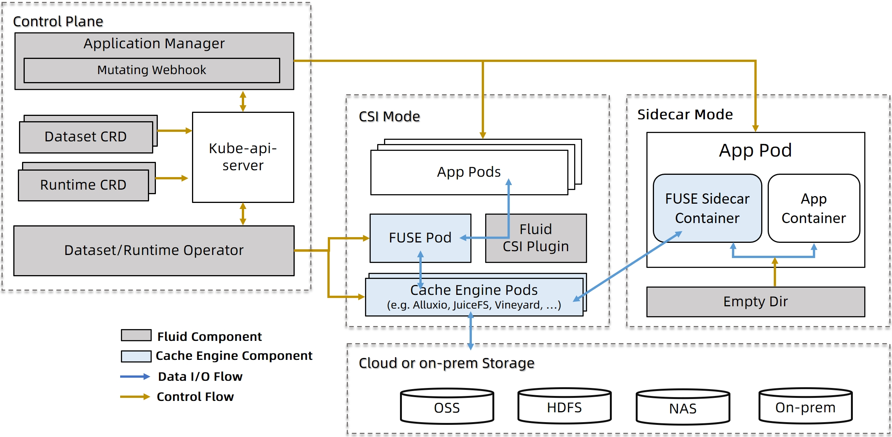

# Architecture and Concepts

## Architecture

Fluid is built in the Kubernetes native fashion. It lies between existing underlying cloud native storage systems and the upper layer data-intensive applications. The architecture of Fluid in Kubernetes is as following:

Specifically, Fluid is logically split into a data plane and a control plane.

- The control plane is composed of **Dataset/Runtime Controller** and **Application Manager**
  - **Dataset/Runtime Controller:** It manages the datasets and also automates the data operations of the dataset, like data load, data migrate, data process and so on.
  - **Application Manager**: It is responsible for scheduling the workload pods according to cache location and managing their life cycles. 
- The data plane is composed of Runtime Plugin and CSI Plugin:
  - **Runtime Plugin**: As a highly extensible plugin, it can help turn various data cache engines into self-managing, self-scaling, self-healing and observable cache services inside of Kubernetes by providing the common framework of Fluid.
  - **Data Access Plugin**: It is responsible for managing different kinds of storage clients in container mode in the same manner. It supports both CSI Plugin and sidecar mode to run FUSE containers.

The following diagram shows the different components.

## Key Concepts

For achieving its goals, Fluid provides some core concepts.

**Dataset**: A Dataset is a set of data logically related that can be used by computing engines, such as Spark for big data analytics and TensorFlow for AI applications. 
* Same as native Kubernetes API definitions, including CRDs
* Users describe the data’s source, type, access mode and cache location
* Users can use observability to make scaling decisions of distributed cache

**Runtime**: The Runtime enforces dataset isolation/share, provides version management, and enables data acceleration by defining a set of interfaces to handle DataSets throughout their lifecycle, allowing for the implementation of management and acceleration functionalities behind these interfaces. Fluid has two kind of Runtime: CacheRuntime and ThinRuntime.
* CacheRuntime, which implements distributed caching solutions including Alluxio, JuiceFS, Vineyard and others 
* ThinRuntime, that provides a unified access interface to systems like CubeFS, GlusterFS, NFS and others.

**Data Operations**: Unlike traditional PVC-based storage abstraction, Fluid takes an Application-oriented perspective to abstract the “process of manipulating data on Kubernetes”. It introduces the concept of elastic Dataset and implements it as a first-class citizen in Kubernetes to enable Dataset CRUD operation, permission control, and data access acceleration. Besides the basic operations like creation, Fluid also provides a set of operations for the defined  Dataset for users to manipulate the data flow. 
* Data Load prefetches data from dataset source to cache system.
* Data Migration syncs data between external storages and dataset .
* Data Process can be used to transform, split, applying dimensionality reduction to data
Distributed cache scale up and down.
