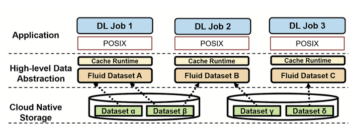
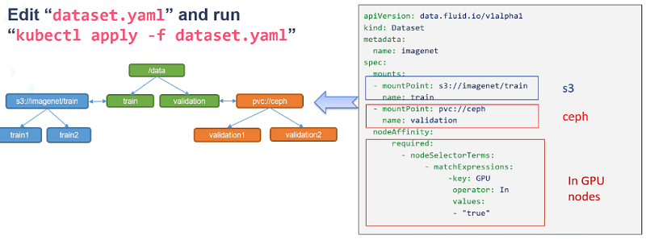

# Architecture and Concepts

## Architecture

Fluid is built in the Kubernetes native fashion. It lies between existing underlying cloud native storage systems and the upper layer data-intensive applications. The architecture of Fluid in Kubernetes is as following:

Specifically, Fluid's architecture is logically split into **control plane** and **data plane**. The following diagram shows the different components.

- **Control Plane**：The control plane is composed of **Dataset/Runtime Operator** and **Application Manager**
- **Dataset/Runtime Operator**: Responsible for the scheduling and orchestration of datasets and their supporting runtimes in Kubernetes. This includes scheduling, migration, and elastic scaling of the runtime for datasets, as well as automated operations for dataset support, such as fine-grained data preheating, such as specifying preheating for a specific folder; controlling metadata backup and recovery to improve data access performance for scenarios with massive small files; and setting pinning policies for cached data to avoid performance fluctuations caused by data eviction.
  
- **Application Manager**:  Responsible for the scheduling and operation of application Pods that use datasets, which is divided into two core components: the Scheduler and the Webhook.
    - Scheduler: schedule application Pods that use datasets in the Kubernetes cluster. By incorporating cached information obtained from the Runtime, Pods that use datasets are preferentially scheduled to nodes that have data caching, without the need for users to specify caching nodes.
    
  - Sidecar Webhook: For Kubernetes environments where the csi-plugin cannot be run, the Sidecar webhook automatically replaces the PVC with a FUSE sidecar and controls the startup order of containers in the Pod to ensure that the FUSE container starts first.

 - **Data Plane**：The data plane is composed of Runtime Plugin and CSI Plugin.
- **Runtime Plugin**: As a highly extensible plugin, it can support various data access engines. Fluid achieves this by abstracting some common features, such as the use of cache media, quotas, directories, etc., making it extensible with different distributed cache engine implementation technologies. For example, the AlluxioRuntime uses a Master-Slave architecture, while the JuiceFSRuntime uses a Worker P2P architecture, both of which can be configured in the CRD of the Runtime. This plugin not only supports specific Runtimes like Alluxio and JuiceFS, but also supports a generic ThinRuntime, enabling users to access generic storage without the need for development.
  
- **CSI Plugin**: The storage client is started in a containerized manner, completely decoupled from the business container. Upgrading the CSI plugin will not affect the business container, and it also supports deploying multiple versions of the storage client in the same Kubernetes cluster. Running the client independently in a Pod also provides observability within the Kubernetes system. Additionally, resource quotas can be set for the client's computing resources.

## Key Concepts

For achieving its goals, Fluid provides some core concepts.

**Dataset**: A Dataset is a set of data logically related that can be used by computing engines, such as Spark for big data analytics and TensorFlow for AI applications. 
* Same as native Kubernetes API definitions, including CRDs
* Users describe the data’s source, type, access mode and cache location
* Users can use observability to make scaling decisions of distributed cache

Dataset management has multiple dimensions, including security, version control, and data acceleration. We aim to provide support for dataset management with a focus on data acceleration. For example, we support aggregation of data from different storage sources, portability, and data features.

* **Data Source**: Supports multiple data sources with different protocols, including HDFS, S3, OSS, and the native Kubernetes Persistent Volume Claim protocol. Multiple data sources can also be mounted under different subdirectories in a unified namespace.
* **Placement Policy**: cached dataset on nodes of different types using the strong and weak affinity and toleration of the nodeAffinity in Kubernetes semantics. 

At the same time, Dataset provides observability, such as how much data is in the dataset, how much cache space is currently available, and what the cache hit rate is. Users can use this information to decide whether to scale up or down.

**Runtime**:  Dataset is a unified abstract concept, and the actual data operations are implemented by specific runtimes. Due to the differences in storage, there are different runtime interfaces. The introduction of runtime is necessary for accessing the data. The API specification here can be defined relatively flexibly, but the lifecycle of the runtime is defined by Fluid in a unified manner, and the implementer of the runtime needs to complete the specific implementation according to the common interface definition. The Runtime enforces dataset isolation/share, provides version management, and enables data acceleration by defining a set of interfaces to handle DataSets throughout their lifecycle, allowing for the implementation of management and acceleration functionalities behind these interfaces. Fluid has two kind of Runtime: CacheRuntime and ThinRuntime.

* CacheRuntime, which implements distributed caching solutions including Alluxio, JuiceFS, Vineyard and others 

* ThinRuntime, that provides a unified access interface to systems like CubeFS, GlusterFS, NFS and others.

**Data Operations**: Unlike traditional PVC-based storage abstraction, Fluid takes an Application-oriented perspective to abstract the “process of manipulating data on Kubernetes”. It introduces the concept of elastic Dataset and implements it as a first-class citizen in Kubernetes to enable Dataset CRUD operation, permission control, and data access acceleration. Besides the basic operations like creation, Fluid also provides a set of operations for the defined  Dataset for users to manipulate the data flow, such as data prefetch, data migration, elastic scaling, cache cleaning, metadata backup, and recovery.

* Data Prefetch: The directory to be prefetched and the preheating strategy can be one-time, scheduled, or event-triggered can be specified.
* Data Migration: Supports both importing data from external storage into a dataset before using it, and using a dataset while importing data into it.
* Data Process: Support  transform, split, applying dimensionality reduction to data
distributed cache scale up and down.

