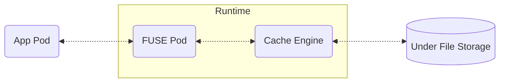

# 访问Dataset中的数据(MountPod挂载模式)

Fluid将会为绑定的Dataset自动创建持久卷声明（PersistentVolumeClaim，PVC），应用Pod可以使用Kubernetes标准的API，指定Fluid创建的PVC作为容器中需要使用的数据卷，从而将运行时引擎的文件系统挂载到容器中的指定目录上。这样，容器可以像访问本地文件一样，经由运行时引擎访问到Dataset中定义的底层存储系统中的文件数据。

Fluid支持两种挂载模式：MountPod挂载模式和Sidecar挂载模式。本章介绍如何使用MountPod挂载模式访问Dataset中的数据。如果需要使用Sidecar挂载模式，请参考[访问Dataset中的数据（Sidecar挂载模式）](./sidecar)。

## 创建应用Pod访问数据

:::info[前提条件]
本节假设你已经在集群中创建了一个与Runtime绑定的Dataset（即`status.phase==Bound`），并且Fluid已经为该Dataset创建了PVC资源。该前置过程请参考Runtime的部署文档。
:::

假设集群中已有如下Fluid创建的名为`mydataset`的PVC资源：
```
$ kubectl get pvc
```
输出结果：
```
NAME                  STATUS   VOLUME                CAPACITY   ACCESS MODES   STORAGECLASS   VOLUMEATTRIBUTESCLASS   AGE
mydataset             Bound    default-mydataset     100Pi      ROX            fluid          <unset>                 157m
```

应用Pod的示例：

```yaml title="pod.yaml"
apiVersion: v1
kind: Pod
metadata:
  name: nginx
spec:
  restartPolicy: Always
  containers:
    - name: demo
      image: nginx
      volumeMounts:
        - mountPath: /data/
          name: data-vol
  volumes:
    - name: data-vol
      persistentVolumeClaim:
        claimName: mydataset # PVC's name is same as Dataset's name
```
上述应用Pod将`mydataset`的PVC（即与Dataset绑定的运行时引擎文件系统）以POSIX文件接口的方式挂载到容器内的`/data`目录下。执行以下命令，创建应用Pod：
```
$ kubectl create -f pod.yaml 
```

最后，登录到应用Pod中验证是否能正常读取Dataset中的数据：
```
$ kubectl exec -it nginx -- ls -l /data/
```
如果一切正常，你会看到`/data/`目录下已经映射了底层存储系统的文件目录结构。

## MountPod高级配置

使用MountPod挂载模式访问数据，其数据访问链路如下图：


其中，FUSE Pod使用[用户态文件系统（Filesystem in Userspace, FUSE）](https://www.kernel.org/doc/html/next/filesystems/fuse.html)在节点上创建文件系统挂载点。在应用Pod被调度到某个节点上时，Fluid会自动在该节点上创建FUSE Pod。如果多个应用Pod在同一节点上访问的是相同的Dataset，那么这些应用Pod将会共享同一个FUSE Pod创建的挂载点。

FUSE负责将应用对本地目录的数据访问请求转换为对运行时引擎的数据访问请求，因此FUSE Pod中容器的资源限制(limits)也会影响到应用感受到的数据访问性能。如果需要修改FUSE Pod的资源请求与限制，那么需要修改Runtime配置为如下（对所有Runtime均生效）：

```yaml title="runtime.yaml"
apiVersion: data.fluid.io/v1alpha1
kind: XXXRuntime
metadata:
  name: mydataset # MUST be same as Dataset's name
  namespace: default
spec:
  ...
  fuse:
    resources:
      requests:
        cpu: 4
        memory: 8Gi
      limits:
        cpu: 8
        # memory: 16Gi
```
:::warning
FUSE创建的用户态文件系统挂载点与容器中运行的FUSE进程是绑定的，如果FUSE进程崩溃，应用Pod将会无法正常访问数据。因此，推荐将FUSE Pod的内存资源限制(`spec.fuse.resources.limits.memory`)设置为比预期更大的值（或者留空），避免OOM造成的业务影响。
:::


