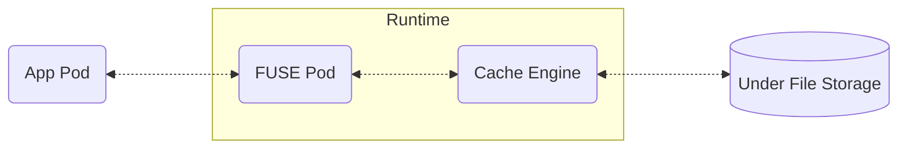
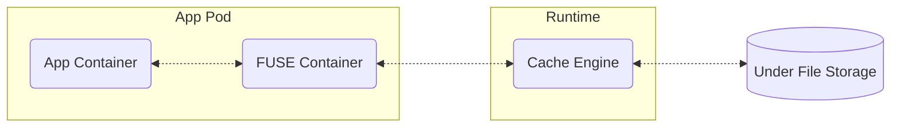

# 以POSIX文件接口访问Dataset中的数据
<span class="runtime-compatibility theme-doc-version-badge badge badge--secondary">功能适用于: Alluxio,Jindo,JuiceFS,Thin</span>

Fluid将会为绑定的Dataset自动创建持久卷声明（PersistentVolumeClaim，PVC）和对应的持久卷（PersistentVolume，PV），应用Pod可以使用Kubernetes标准的API，指定Fluid创建的PVC作为容器中需要使用的数据卷，从而将运行时引擎的文件系统挂载到容器中的指定目录上。这样，容器可以像访问本地文件一样，经由运行时引擎访问到Dataset中定义的底层存储系统中的文件数据。

Fluid支持两种挂载模式：**MountPod挂载模式和Sidecar挂载模式**。本章介绍如何使用这两种挂载模式访问Dataset中的数据。

## 创建应用Pod访问数据

:::info[前提条件]
本节假设你已经在集群中创建了一个与Runtime绑定的Dataset（即`status.phase==Bound`），并且Fluid已经为该Dataset创建了PVC资源。该前置过程请参考Runtime的部署文档。
:::

假设集群中已有如下Fluid创建的名为`mydataset`的PVC资源：
```
$ kubectl get pvc
```
输出结果：
```
NAME                  STATUS   VOLUME                CAPACITY   ACCESS MODES   STORAGECLASS   VOLUMEATTRIBUTESCLASS   AGE
mydataset             Bound    default-mydataset     100Pi      ROX            fluid          <unset>                 157m
```

import Tabs from '@theme/Tabs';
import TabItem from '@theme/TabItem';

<Tabs groupId="mount-mode">
  <TabItem value="MountPod" label="Mount Pod">
    ```yaml title="pod.yaml"
    apiVersion: v1
    kind: Pod
    metadata:
      name: nginx
    spec:
      restartPolicy: Always
      containers:
        - name: demo
          image: nginx
          volumeMounts:
            - mountPath: /data/
              name: data-vol
      volumes:
        - name: data-vol
          persistentVolumeClaim:
            claimName: mydataset # PVC's name is same as Dataset's name
    ```
    上述应用Pod将`mydataset`的PVC（即与Dataset绑定的运行时引擎文件系统）以POSIX文件接口的方式挂载到容器内的`/data`目录下。

    使用MountPod挂载模式时，直接将与Dataset同名的PVC作为容器挂载的数据卷，挂载到容器中的指定路径。
  </TabItem>
  <TabItem value="Sidecar" label="Sidecar">
    ```yaml title="pod.yaml"
    apiVersion: v1
    kind: Pod
    metadata:
      name: nginx
      labels:
        serverless.fluid.io/inject: "true"
    spec:
      restartPolicy: Always
      containers:
        - name: demo
          image: nginx
          volumeMounts:
            - mountPath: /data/
              name: data-vol
      volumes:
        - name: data-vol
          persistentVolumeClaim:
            claimName: mydataset # PVC's name is same as Dataset's name
    ```
    上述应用Pod将`mydataset`的PVC（即与Dataset绑定的运行时引擎文件系统）以POSIX文件接口的方式挂载到容器内的`/data`目录下。

    使用Sidecar挂载模式时，除了将与Dataset同名的PVC作为容器挂载的数据卷挂载到容器中的指定路径外，还需要在`Pod.metadata.labels`中增加标签`serverless.fluid.io/inject=true`。当包含该标签的Pod创建时，Fluid自动将Pod中的PVC转换为Sidecar容器，为Pod中的其他应用容器提供文件系统挂载点。
  </TabItem>
</Tabs>


执行以下命令，创建应用Pod：
```
$ kubectl create -f pod.yaml 
```

最后，登录到应用Pod中验证是否能正常读取Dataset中的数据：
```
$ kubectl exec -it nginx -c demo -- ls -l /data/
```
如果一切正常，你会看到`/data/`目录下已经映射了底层存储系统的文件目录结构。

## 挂载模式进阶配置

<Tabs groupId="mount-mode">
  <TabItem value="MountPod" label="Mount Pod">
  使用MountPod挂载模式访问数据，其数据访问链路如下图：


FUSE Pod使用[用户态文件系统（Filesystem in Userspace, FUSE）](https://www.kernel.org/doc/html/next/filesystems/fuse.html)在节点上创建文件系统挂载点。在应用Pod被调度到某个节点上时，Fluid会自动在该节点上按需创建FUSE Pod（不存在时创建）。如果多个应用Pod在同一节点上访问的是同一个Dataset，那么这些应用Pod将会共享同一个FUSE Pod创建的挂载点。
  </TabItem>
  <TabItem value="Sidecar" label="Sidecar">
 使用Sidecar挂载模式访问数据，其数据访问链路如下图：


  应用Pod创建时，Fluid将会自动将FUSE Container（也就是Sidecar容器）注入到应用Pod中。FUSE Container容器首先启动，使用[用户态文件系统（Filesystem in Userspace, FUSE）](https://www.kernel.org/doc/html/next/filesystems/fuse.html)创建Pod内可共享的文件系统挂载点。如果一个应用Pod中需要访问多个Dataset，则会对应创建多个Sidecar容器，多个应用Pod之间不共享这些挂载点。
  </TabItem>
</Tabs>


### FUSE Pod/Sidecar资源配置

FUSE将应用对本地目录的数据访问请求转换为对运行时引擎的数据访问请求，因此FUSE Pod/Sidecar容器的资源限制(limits)也会影响到应用感受到的数据访问性能。如果需要修改FUSE Pod/Sidecar容器的资源请求与限制，那么需要修改Runtime配置为如下：

```yaml title="runtime.yaml"
apiVersion: data.fluid.io/v1alpha1
kind: XXXRuntime  # Replace with your Runtime Kind.
metadata:
  name: mydataset # MUST be same as Dataset's name
  namespace: default
spec:
  ...
  fuse:
    resources:
      requests:
        cpu: 4
        memory: 8Gi
      limits:
        cpu: 8
        # memory: 16Gi
```
:::warning
FUSE创建的用户态文件系统挂载点依赖于容器中运行的FUSE进程以正常处理数据。如果FUSE进程崩溃，应用Pod将会无法正常访问数据。因此，推荐将FUSE Pod的内存资源限制(`spec.fuse.resources.limits.memory`)设置为比预期更大的值（或者留空），避免OOM造成的业务影响。
:::

### FUSE Pod生命周期策略

在应用Pod被调度到某个节点上时，Fluid会自动在该节点上按需创建FUSE Pod。默认情况下，FUSE Pod创建后将会持续存在，直至与FUSE Pod相关的Runtime资源删除。
如果挂载相同Dataset的其他应用Pod调度到该节点，这些应用Pod将会复用已经存在的FUSE Pod。

常驻的FUSE Pod本质上创建了一个常驻的文件系统挂载点。该文件系统的状态（如高频访问的热点数据元信息，[内核页缓存](https://en.wikipedia.org/wiki/Page_cache)等）可以被不同的应用Pod重用。
但常驻的FUSE Pod意味着它会长时间占用所在节点的更多资源，为此，Fluid支持为FUSE Pod配置生命周期策略，配置示例如下：

```yaml title="runtime.yaml"
apiVersion: data.fluid.io/v1alpha1
kind: XXXRuntime  # Replace with your Runtime Kind.
metadata:
  name: mydataset # MUST be same as Dataset's name
  namespace: default
spec:
  ...
  fuse:
  # highlight-next-line
    cleanPolicy: OnDemand # defaults to OnRuntimeDeleted
```
配置`spec.fuse.cleanPolicy`为`OnDemand`，可配置仅在同节点上有需要挂载文件系统的应用Pod时保留FUSE Pod。

